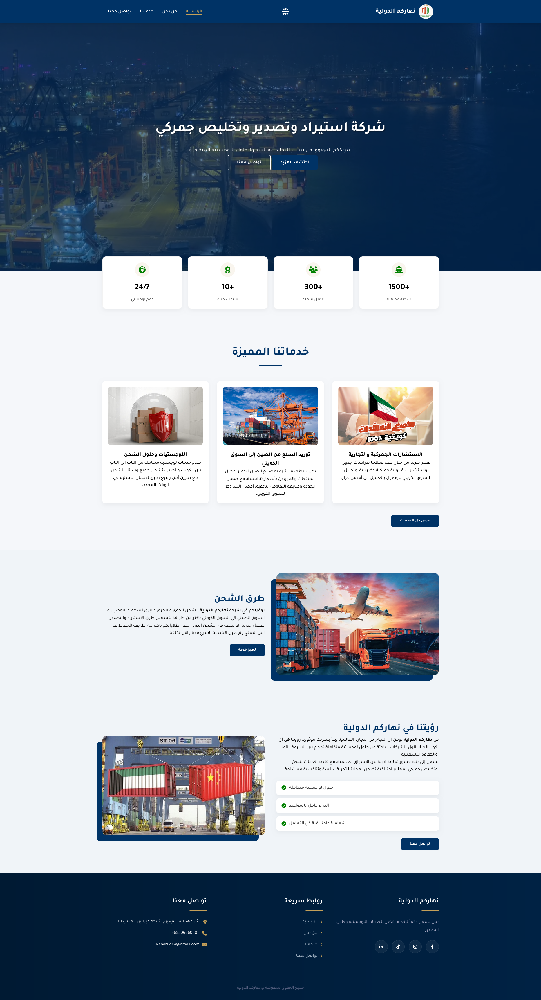

# Naharco International Project

Welcome to the **Naharco International** project! This repository showcases a comprehensive web application designed to provide information about the Naharco International organization. The application aims to offer an engaging user experience to highlight the services provided by the organization.

## Project Demo En


## Project Demo Ar


## Project Description

Naharco International is a personal and professional platform that aims to showcase the various services offered by Naharco International. The web application includes sections dedicated to the organization's mission, services, blog posts, and contact information, facilitating navigation and outreach for inquiries.

### Key Features

- **Home Page**: A welcoming introduction to the organization.
- **About Us**: Detailed information about the organization's mission and values.
- **Services**: Overview of the services provided.
- **Blog**: A section for sharing insights and updates.
- **Contact Us**: Easy access for users to get in touch.

## Tech Stack

The Naharco International project is built using the following technologies:

- **HTML**: For structuring the web pages.
- **CSS**: For styling and enhancing the visual appeal of the application.
- **JavaScript**: For creating interactive elements and improving user experience.

## Live Server

You can view the live version of the application at the following link:  
[Live Demo](#)  

## Contributors

This project is a collaborative effort by multiple developers:

- **Islam Hamdy**: islam.124.hamdy@gmail.com
- **Adel Ahmed**: adel.307.ahmed@gmail.com
- **Ahmed Eid**: eid93461@gmail.com

## Installation

To run the project locally, follow these steps:

1. Clone the repository:
   ```bash
   git clone https://github.com/ahmed1eid/naharco-alduwlya.git

Navigate into the project directory:
bash
cd naharco-alduwlya

Open index.html in your preferred web browser.
Contribution
Feel free to fork the repository and submit pull requests. Feedback and suggestions for improvement are always welcome!

Thank you for visiting the Naharco International project!


This format follows standard conventions for README files, ensuring clarity and organization.

